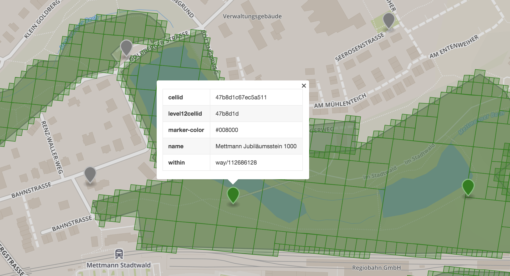

# EX-Raid Arenen in Mettmann

Karte mit potentiellen EX-Raid-Arenen (grüne Flächen = Parks gemäß OSM):

## Detailsansicht Stadtwald:

- Die Goldberger Mühle scheint gerade nicht in einer Park-Fläche zu liegen
- Jubiläumsstein und Holzskulptur sind in der *gleichen* S2-Zelle

Hier gibt's eine [interaktive Version der Karte](http://bl.ocks.org/d/7f23238679709016bf8236eae521276d). Achtung: lädt langsam wg. des feines Rasters der Parkflächen.

# EX-Raid Historie in Mettmann

| Arena | Ex-Raid Datum | Datum der Einladung  |
| ------------- |-------------|-----|
| Mettmann Jubiläumstein 1000 | 16.01.2018 | 07.01.2018 |
| Mettmann Jubiläumstein 1000 | 03.02.2018 17:30 | 01.02.2018 |
| Holzskulptur mit Kalksteine | 11.02.2018 14:30 | 06.02.2018 |

# Links
- [Tutorial zur Identifizierung potentieller EX-Raid Arenen](https://blog.codecentric.de/2018/02/ex-raid-arenen-pokemon-go/)
- [Allgemeines zu EX-Raid Intervallen](https://www.reddit.com/r/TheSilphRoad/comments/7qg8pf/updated_ex_raid_invites_pattern_recognition/)
