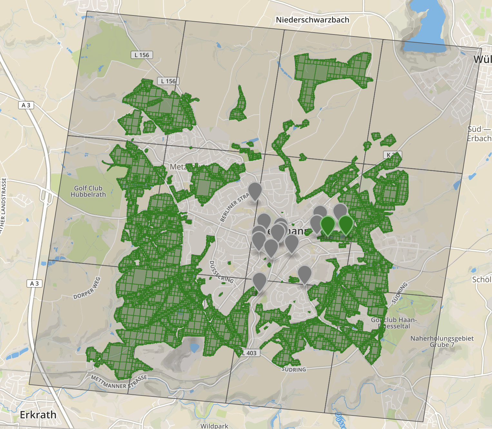
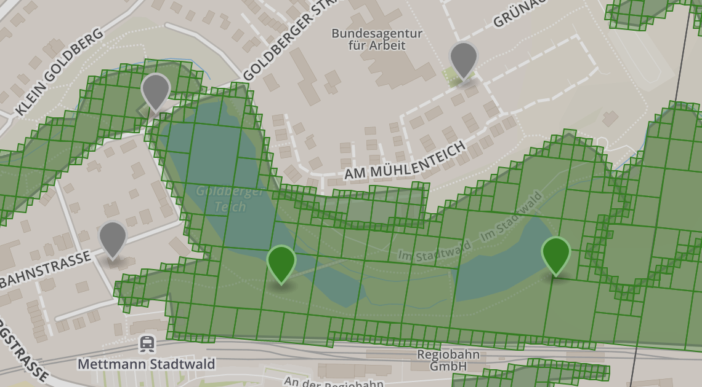

# Ex-Raid-Arenen in Mettmann

Karte mit potentiellen Ex-Raid-Arenen (grüne Flächen = Parks gemäß OSM):

## Detailsansicht Goldberg / Stadtwald:

- Die Goldberger Mühle scheint gerade nicht in einer Park-Fläche zu liegen
- Jubiläumsstein und Holzskulptur sind in der *gleichen* S2-Zelle

Hier gibt's eine [interaktive Version der Karte](http://bl.ocks.org/d/7f23238679709016bf8236eae521276d). Achtung: lädt langsam wg. des feines Rasters der Parkflächen.

# Ex-Raid Historie in Mettmann
- 16.01.2018 Mettmann  Jubiläumstein 1000

# Ex-Raid Intervalle:
- https://www.reddit.com/r/TheSilphRoad/comments/7qg8pf/updated_ex_raid_invites_pattern_recognition/

# Verfahren zu Herstellung der Karte
- Karten
https://www.reddit.com/r/TheSilphRoad/comments/7ojuoi/how_to_determine_which_gyms_are_eligible_from_ex/ Kapitel 4.2
- Tool [osmcoverer](https://github.com/MzHub/osmcoverer)
- S2 L12
 https://www.reddit.com/r/TheSilphRoad/comments/7ow4ix/s2_cells_go_the_various_levels_applied_that_were/
